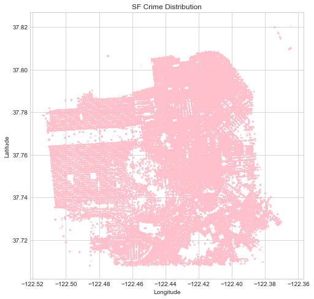
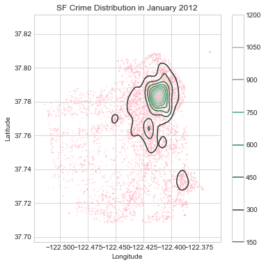
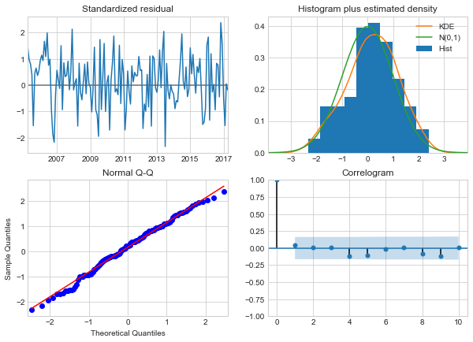

```python
# Imports
import os
import pandas as pd
from pandas import Series, DataFrame
import pandas_profiling

pd.set_option('display.max_rows', None,'display.max_columns', None)
%matplotlib inline
import numpy as np
import matplotlib.pyplot as plt
import seaborn as sns
sns.set_style('whitegrid')

from collections import Counter

from sklearn.linear_model import LogisticRegression
from sklearn.svm import SVC, LinearSVC
from sklearn.ensemble import RandomForestClassifier, AdaBoostClassifier, GradientBoostingClassifier, ExtraTreesClassifier, VotingClassifier
from sklearn.discriminant_analysis import LinearDiscriminantAnalysis
from sklearn.neighbors import KNeighborsClassifier
from sklearn.naive_bayes import GaussianNB
from sklearn.tree import DecisionTreeClassifier
from sklearn.neural_network import MLPClassifier
from sklearn.model_selection import GridSearchCV, cross_val_score, StratifiedKFold, learning_curve, cross_validate
from sklearn.metrics import confusion_matrix, precision_score, recall_score, f1_score, make_scorer

from scipy.stats import ks_2samp
from treeinterpreter import treeinterpreter as ti

from sklearn.preprocessing import Imputer, StandardScaler
#from sklearn import cross_validation
from sklearn import metrics
```

# Data


```python
df = pd.read_csv('../input/Police_Department_Incidents_July2018.csv')
```


```python
df.info()
```

    <class 'pandas.core.frame.DataFrame'>
    RangeIndex: 2215024 entries, 0 to 2215023
    Data columns (total 13 columns):
    IncidntNum    int64
    Category      object
    Descript      object
    DayOfWeek     object
    Date          object
    Time          object
    PdDistrict    object
    Resolution    object
    Address       object
    X             float64
    Y             float64
    Location      object
    PdId          int64
    dtypes: float64(2), int64(2), object(9)
    memory usage: 219.7+ MB


```python
df.sample(5)
```


<div>
<style scoped>
    .dataframe tbody tr th:only-of-type {
        vertical-align: middle;
    }

    .dataframe tbody tr th {
        vertical-align: top;
    }

    .dataframe thead th {
        text-align: right;
    }
</style>
<table border="1" class="dataframe">
  <thead>
    <tr style="text-align: right;">
      <th></th>
      <th>IncidntNum</th>
      <th>Category</th>
      <th>Descript</th>
      <th>DayOfWeek</th>
      <th>Date</th>
      <th>Time</th>
      <th>PdDistrict</th>
      <th>Resolution</th>
      <th>Address</th>
      <th>X</th>
      <th>Y</th>
      <th>Location</th>
      <th>PdId</th>
    </tr>
  </thead>
  <tbody>
    <tr>
      <th>990091</th>
      <td>60710807</td>
      <td>NON-CRIMINAL</td>
      <td>LOST PROPERTY</td>
      <td>Tuesday</td>
      <td>07/04/2006</td>
      <td>07:00</td>
      <td>SOUTHERN</td>
      <td>NONE</td>
      <td>800 Block of BRYANT ST</td>
      <td>-122.403405</td>
      <td>37.775421</td>
      <td>(37.775420706711, -122.403404791479)</td>
      <td>6071080771000</td>
    </tr>
    <tr>
      <th>1134475</th>
      <td>40319015</td>
      <td>VEHICLE THEFT</td>
      <td>VEHICLE, RECOVERED, AUTO</td>
      <td>Thursday</td>
      <td>03/18/2004</td>
      <td>20:00</td>
      <td>MISSION</td>
      <td>NONE</td>
      <td>700 Block of CASTRO ST</td>
      <td>-122.434589</td>
      <td>37.757275</td>
      <td>(37.7572745170586, -122.43458904104)</td>
      <td>4031901507041</td>
    </tr>
    <tr>
      <th>454242</th>
      <td>40001585</td>
      <td>BURGLARY</td>
      <td>BURGLARY OF HOTEL ROOM, UNLAWFUL ENTRY</td>
      <td>Wednesday</td>
      <td>12/31/2003</td>
      <td>18:30</td>
      <td>CENTRAL</td>
      <td>NONE</td>
      <td>900 Block of CALIFORNIA ST</td>
      <td>-122.409999</td>
      <td>37.791882</td>
      <td>(37.79188233556, -122.409999361883)</td>
      <td>4000158505033</td>
    </tr>
    <tr>
      <th>1326220</th>
      <td>51030640</td>
      <td>VANDALISM</td>
      <td>MALICIOUS MISCHIEF, VANDALISM</td>
      <td>Monday</td>
      <td>09/12/2005</td>
      <td>20:00</td>
      <td>NORTHERN</td>
      <td>NONE</td>
      <td>600 Block of LARCH ST</td>
      <td>-122.428151</td>
      <td>37.781533</td>
      <td>(37.7815325510309, -122.42815115473)</td>
      <td>5103064028150</td>
    </tr>
    <tr>
      <th>629074</th>
      <td>40337716</td>
      <td>VEHICLE THEFT</td>
      <td>STOLEN AUTOMOBILE</td>
      <td>Tuesday</td>
      <td>03/23/2004</td>
      <td>16:35</td>
      <td>BAYVIEW</td>
      <td>NONE</td>
      <td>3RD ST / LA SALLE AV</td>
      <td>-122.389866</td>
      <td>37.737170</td>
      <td>(37.7371699446517, -122.389865610375)</td>
      <td>4033771607021</td>
    </tr>
  </tbody>
</table>
</div>


```python
df.dtypes
```


    IncidntNum      int64
    Category       object
    Descript       object
    DayOfWeek      object
    Date           object
    Time           object
    PdDistrict     object
    Resolution     object
    Address        object
    X             float64
    Y             float64
    Location       object
    PdId            int64
    dtype: object


```python
# Define a function to visulize the features with missing values, and % of total values, & datatype
def missing_values_table(df):
     # Total missing values
    mis_val = df.isnull().sum()
    # Percentage of missing values
    mis_val_percent = 100 * df.isnull().sum() / len(df)
    mis_val_type = df.dtypes
    # Make a table with the results
    mis_val_table = pd.concat([mis_val, mis_val_percent, mis_val_type], axis=1)
        
     # Rename the columns
    mis_val_table_ren_columns = mis_val_table.rename(columns = {0 : 'Missing Values', 1 : '% of Total Values', 2: 'type'})
        
    # Sort the table by percentage of missing descending
    mis_val_table_ren_columns = mis_val_table_ren_columns[ mis_val_table_ren_columns.iloc[:,1] != 0].sort_values('% of Total Values', ascending=False).round(1)
        
    # Print some summary information
    print ("Your selected dataframe has " + str(df.shape[1]) + " columns.\n" "There are " + str(mis_val_table_ren_columns.shape[0]) + " columns that have missing values.")
        
    # Return the dataframe with missing information
    return mis_val_table_ren_columns
```


```python
missing_values_table(df)
```

    Your selected dataframe has 13 columns.
    There are 1 columns that have missing values.


<div>
<style scoped>
    .dataframe tbody tr th:only-of-type {
        vertical-align: middle;
    }

    .dataframe tbody tr th {
        vertical-align: top;
    }

    .dataframe thead th {
        text-align: right;
    }
</style>
<table border="1" class="dataframe">
  <thead>
    <tr style="text-align: right;">
      <th></th>
      <th>Missing Values</th>
      <th>% of Total Values</th>
      <th>type</th>
    </tr>
  </thead>
  <tbody>
    <tr>
      <th>PdDistrict</th>
      <td>1</td>
      <td>0.0</td>
      <td>object</td>
    </tr>
  </tbody>
</table>
</div>


There is only one missing value in the dataset of the feature "PdDistrict". I will just drop this entry. 


```python
i=df.index[df.isnull().any(axis=1)]
i
```


    Int64Index([2013150], dtype='int64')


```python
df.drop([2013150], axis=0, inplace=True)
```


```python
df.shape
```


    (2215023, 13)


# EDA: Inspect the remaining features one by one


```python
df.sample(5)
```


<div>
<style scoped>
    .dataframe tbody tr th:only-of-type {
        vertical-align: middle;
    }

    .dataframe tbody tr th {
        vertical-align: top;
    }

    .dataframe thead th {
        text-align: right;
    }
</style>
<table border="1" class="dataframe">
  <thead>
    <tr style="text-align: right;">
      <th></th>
      <th>IncidntNum</th>
      <th>Category</th>
      <th>Descript</th>
      <th>DayOfWeek</th>
      <th>Date</th>
      <th>Time</th>
      <th>PdDistrict</th>
      <th>Resolution</th>
      <th>Address</th>
      <th>X</th>
      <th>Y</th>
      <th>Location</th>
      <th>PdId</th>
    </tr>
  </thead>
  <tbody>
    <tr>
      <th>559012</th>
      <td>136214068</td>
      <td>LARCENY/THEFT</td>
      <td>PETTY THEFT OF PROPERTY</td>
      <td>Tuesday</td>
      <td>11/12/2013</td>
      <td>18:30</td>
      <td>INGLESIDE</td>
      <td>NONE</td>
      <td>1000 Block of CAYUGA AV</td>
      <td>-122.440007</td>
      <td>37.721805</td>
      <td>(37.7218048835547, -122.440006611531)</td>
      <td>13621406806372</td>
    </tr>
    <tr>
      <th>1882140</th>
      <td>180191298</td>
      <td>ROBBERY</td>
      <td>ROBBERY, BODILY FORCE</td>
      <td>Tuesday</td>
      <td>03/13/2018</td>
      <td>13:30</td>
      <td>MISSION</td>
      <td>NONE</td>
      <td>800 Block of DUNCAN ST</td>
      <td>-122.439037</td>
      <td>37.745415</td>
      <td>(37.74541538407238, -122.43903671452179)</td>
      <td>18019129803074</td>
    </tr>
    <tr>
      <th>2085991</th>
      <td>176326372</td>
      <td>NON-CRIMINAL</td>
      <td>LOST PROPERTY</td>
      <td>Saturday</td>
      <td>12/16/2017</td>
      <td>01:30</td>
      <td>MISSION</td>
      <td>NONE</td>
      <td>800 Block of YORK ST</td>
      <td>-122.408796</td>
      <td>37.758452</td>
      <td>(37.758452247406126, -122.40879634921586)</td>
      <td>17632637271000</td>
    </tr>
    <tr>
      <th>227152</th>
      <td>150759337</td>
      <td>OTHER OFFENSES</td>
      <td>DRIVERS LICENSE, SUSPENDED OR REVOKED</td>
      <td>Sunday</td>
      <td>08/30/2015</td>
      <td>00:42</td>
      <td>BAYVIEW</td>
      <td>ARREST, BOOKED</td>
      <td>EVANS AV / PHELPS ST</td>
      <td>-122.388457</td>
      <td>37.742983</td>
      <td>(37.7429830266541, -122.388456834121)</td>
      <td>15075933765016</td>
    </tr>
    <tr>
      <th>49221</th>
      <td>140822289</td>
      <td>NON-CRIMINAL</td>
      <td>FOUND PROPERTY</td>
      <td>Monday</td>
      <td>09/29/2014</td>
      <td>19:20</td>
      <td>CENTRAL</td>
      <td>NONE</td>
      <td>CHESTNUT ST / SANSOME ST</td>
      <td>-122.403532</td>
      <td>37.804969</td>
      <td>(37.8049688863959, -122.403532080065)</td>
      <td>14082228972000</td>
    </tr>
  </tbody>
</table>
</div>


#### IncidentNum


```python
df.IncidntNum.describe()
```


    count    2.215023e+06
    mean     1.040727e+08
    std      4.612826e+07
    min      3.979000e+03
    25%      6.124170e+07
    50%      1.011558e+08
    75%      1.409256e+08
    max      9.915824e+08
    Name: IncidntNum, dtype: float64


```python
len(df.IncidntNum.unique())
```


    1746913


#### Category


```python
df.Category.describe()
```


    count           2215023
    unique               39
    top       LARCENY/THEFT
    freq             480447
    Name: Category, dtype: object


```python
#frequency count for Category
df.Category.value_counts().plot(kind="bar", figsize=(12,5))
```


    <matplotlib.axes._subplots.AxesSubplot at 0x116642860>


```python
df.Category.value_counts(normalize=True)
```


    LARCENY/THEFT                  0.216904
    OTHER OFFENSES                 0.139664
    NON-CRIMINAL                   0.107594
    ASSAULT                        0.087897
    VEHICLE THEFT                  0.057156
    DRUG/NARCOTIC                  0.054008
    VANDALISM                      0.052396
    WARRANTS                       0.045769
    BURGLARY                       0.041328
    SUSPICIOUS OCC                 0.036317
    MISSING PERSON                 0.029327
    ROBBERY                        0.025222
    FRAUD                          0.018755
    SECONDARY CODES                0.011662
    FORGERY/COUNTERFEITING         0.010406
    WEAPON LAWS                    0.010038
    TRESPASS                       0.008780
    PROSTITUTION                   0.007540
    STOLEN PROPERTY                0.005368
    SEX OFFENSES, FORCIBLE         0.005301
    DISORDERLY CONDUCT             0.004533
    DRUNKENNESS                    0.004436
    RECOVERED VEHICLE              0.003935
    DRIVING UNDER THE INFLUENCE    0.002561
    KIDNAPPING                     0.002414
    RUNAWAY                        0.002004
    LIQUOR LAWS                    0.001843
    ARSON                          0.001775
    EMBEZZLEMENT                   0.001349
    LOITERING                      0.001097
    SUICIDE                        0.000583
    FAMILY OFFENSES                0.000534
    BAD CHECKS                     0.000418
    BRIBERY                        0.000367
    EXTORTION                      0.000335
    SEX OFFENSES, NON FORCIBLE     0.000195
    GAMBLING                       0.000157
    PORNOGRAPHY/OBSCENE MAT        0.000027
    TREA                           0.000006
    Name: Category, dtype: float64


The top crime is "LARCENY/THEFT" (22%, 480k incidents)

#### Descript


```python
df.Descript.describe()
```


    count                          2215023
    unique                             915
    top       GRAND THEFT FROM LOCKED AUTO
    freq                            178835
    Name: Descript, dtype: object


```python
df[['Category','Descript']].sample(5)
```


<div>
<style scoped>
    .dataframe tbody tr th:only-of-type {
        vertical-align: middle;
    }

    .dataframe tbody tr th {
        vertical-align: top;
    }

    .dataframe thead th {
        text-align: right;
    }
</style>
<table border="1" class="dataframe">
  <thead>
    <tr style="text-align: right;">
      <th></th>
      <th>Category</th>
      <th>Descript</th>
    </tr>
  </thead>
  <tbody>
    <tr>
      <th>1760020</th>
      <td>ROBBERY</td>
      <td>ATTEMPTED ROBBERY WITH BODILY FORCE</td>
    </tr>
    <tr>
      <th>676578</th>
      <td>VEHICLE THEFT</td>
      <td>STOLEN AUTOMOBILE</td>
    </tr>
    <tr>
      <th>1543723</th>
      <td>LARCENY/THEFT</td>
      <td>GRAND THEFT OF PROPERTY</td>
    </tr>
    <tr>
      <th>902592</th>
      <td>OTHER OFFENSES</td>
      <td>DRIVERS LICENSE, SUSPENDED OR REVOKED</td>
    </tr>
    <tr>
      <th>1508956</th>
      <td>LARCENY/THEFT</td>
      <td>GRAND THEFT FROM A BUILDING</td>
    </tr>
  </tbody>
</table>
</div>


"Descript" is included in "Category", but with more details (e.g., location, results, etc). 

#### DayOfWeek


```python
df.DayOfWeek.describe()
```


    count     2215023
    unique          7
    top        Friday
    freq       337941
    Name: DayOfWeek, dtype: object


```python
df.DayOfWeek.value_counts()
```


    Friday       337941
    Wednesday    324020
    Saturday     320593
    Thursday     316156
    Tuesday      315135
    Monday       306587
    Sunday       294591
    Name: DayOfWeek, dtype: int64


```python
plt.figure(figsize=(6,4))
df['DayOfWeek'].value_counts().sort_values().plot.bar()
plt.xlabel('Day')
plt.ylabel('Number of crimes')
plt.title('Day of week')
```


    Text(0.5,1,'Day of week')


Friday has the most number of crimes, while Sunday is the safest day.

#### Date


```python
df.Date.describe()
```


    count        2215023
    unique          5613
    top       01/01/2011
    freq             650
    Name: Date, dtype: object


```python
df.Date.sample()
```


    119553    09/01/2014
    Name: Date, dtype: object


This indicates the date of the crime, which may be useful when doing the time series analysis. Let's first convert "Date" to "Year", "Month", "Day"


```python
from datetime import datetime

#%timeit pd.to_datetime(df.Date, infer_datetime_format=True)
```


```python
df.Date =  pd.to_datetime(df.Date, infer_datetime_format=True)
```


```python
df.Date.sample()
```


    527786   2009-09-24
    Name: Date, dtype: datetime64[ns]


```python
# create a scalar "length" to describe the length of time [in years] since the date of the incident to today. 
dttoday = datetime.now().strftime('%Y-%m-%d')
df['length'] = df.Date.apply(lambda x:(np.timedelta64((x - pd.Timestamp(dttoday)),'D').astype(int))/-365)
```


```python
df['Year'] = df.Date.map(lambda x: int(x.strftime('%Y-%m-%d').split('-')[0]))
df['Month'] = df.Date.map(lambda x: int(x.strftime('%Y-%m-%d').split('-')[1]))
df['Day'] = df.Date.map(lambda x: int(x.strftime('%Y-%m-%d').split('-')[2]))
```


```python
df.Year.value_counts().sort_values()
```


    2018     46668
    2011    132697
    2010    133523
    2007    137639
    2006    137853
    2009    139860
    2012    140847
    2008    141311
    2005    142186
    2004    148148
    2003    149176
    2014    150128
    2016    150882
    2013    152806
    2017    154773
    2015    156526
    Name: Year, dtype: int64


```python
# visulize in a bar plot
fig = plt.figure(figsize=[8, 3])
plt.bar(sorted(df.Year.value_counts().index), df.Year.value_counts().values[np.argsort(df.Year.value_counts().index)])
plt.xlabel('Year')
plt.ylabel('Number of Incidents')
plt.xlim((2004.5,2018.5))
#plt.ylim((150000,200000))
plt.xticks(np.arange(2005,2019) )
plt.show()
```


2018 is imcomplete. Among other years, 2015 has the most number of incidents. 


```python
df.Month.value_counts().sort_values()
```


    12    170776
    6     174744
    11    175032
    2     178619
    7     181822
    9     183437
    8     187379
    5     187747
    4     189834
    10    190470
    3     197580
    1     197583
    Name: Month, dtype: int64


```python
# visulize in a bar plot
fig = plt.figure(figsize=[8, 3])
plt.bar(sorted(df.Month.value_counts().index), df.Month.value_counts().values[np.argsort(df.Month.value_counts().index)])
plt.xlabel('Month')
plt.ylabel('Number of Incidents')
plt.xlim((0.5,12.5))
plt.ylim((150000,200000))
plt.xticks( np.arange(1,13) )
plt.show()
```


January and March has the most number of the incidents, while June and February has the least number of the incidents. Holiday season (December, November) is not that bad. 


```python
#df.Day.value_counts().sort_values()
```


```python
# visulize in a bar plot
fig = plt.figure(figsize=[8,3])
plt.bar(sorted(df.Day.value_counts().index), df.Day.value_counts().values[np.argsort(df.Day.value_counts().index)])
plt.xlabel('Day')
plt.ylabel('Number of Incidents')
plt.xlim((0.5,31.5))
#plt.ylim((150000,200000))
plt.xticks( np.arange(1,32) )
plt.show()
```


Interestingly, the first day of a month has significant higher number of incidents, and the last day (30th) of a month has the lowest number. 

#### Time


```python
df.Time.describe()
```


    count     2215023
    unique       1439
    top         12:00
    freq        57232
    Name: Time, dtype: object


```python
df.Time.value_counts().nlargest(5)
```


    12:00    57232
    00:01    56404
    18:00    48564
    17:00    42266
    19:00    41862
    Name: Time, dtype: int64


```python
df.Time.value_counts().nsmallest(5)
```


    05:32    103
    05:31    105
    06:01    110
    05:23    110
    05:38    114
    Name: Time, dtype: int64


It seems that the most dangerous time of the day with the most number of crimes are around midnight, and around sunset. The 12:00 is suspecious here. Does it mean noon time or midnight? Let's convert "Time" to float values and check its distribution. 


```python
df['Time_float'] = df.Time.map(lambda x: int(x.split(':')[0]) + float(x.split(':')[1])/60)
```


```python
# visulize in a histogram plot
fig = plt.figure(figsize=[9,3])
plt.hist(df['Time_float'], bins=24, alpha = 0.6)
plt.xlabel('Time of a day')
plt.ylabel('Number of Incidents')
plt.xlim((0.0, 24))
plt.xticks( np.arange(0,25) )
plt.show()
```


So, there are significantly more incidents around midnight and noon (?!) time. I didn't expect noon is so unsave. Let's check what are the crimes arond noon time. 


```python
# at Noon
df['Category'].loc[(df.Time_float > 11.5) & (df.Time_float < 12.5)].value_counts().nlargest(5)
```


    LARCENY/THEFT     22770
    OTHER OFFENSES    18510
    NON-CRIMINAL      15962
    ASSAULT            9124
    DRUG/NARCOTIC      5561
    Name: Category, dtype: int64


```python
# at Midnight
df['Category'].loc[(df.Time_float > 23) | (df.Time_float < 1.5)].value_counts().nlargest(5)
```


    LARCENY/THEFT     38661
    OTHER OFFENSES    37197
    ASSAULT           22681
    NON-CRIMINAL      20276
    VANDALISM         13267
    Name: Category, dtype: int64


```python
# overall
df['Category'].value_counts().nlargest(5)
```


    LARCENY/THEFT     480447
    OTHER OFFENSES    309358
    NON-CRIMINAL      238323
    ASSAULT           194694
    VEHICLE THEFT     126602
    Name: Category, dtype: int64


Comparing the types of the indidents at noon, at midnight & during the day, we can see that "LARCENY/THEFT" and "OTHER OFFENSES" are the most 2 common incidents. At noon, there are more "Durg/NAROCOTIC", while at midnight, there are more, "ASSAULT" and "VANDALISM". I think this makes sense. 


```python
# number of incidents at day/night
print('number of incidents before 12pm:', df.loc[(df.Time_float < 12)].shape[0])
print('number of incidents after 12pm:', df.loc[(df.Time_float >= 12)].shape[0])
```

    number of incidents before 12pm: 770018
    number of incidents after 12pm: 1445005


The number of incidents in the afternoon and before midnight is double the number of incidents in the morning. 

#### PdDistrict


```python
df.PdDistrict.describe()
```


    count      2215023
    unique          10
    top       SOUTHERN
    freq        399785
    Name: PdDistrict, dtype: object


```python
#df.PdDistrict.value_counts()
```


```python
# Normalize and visualize the top 10 PdDistrict
counts_pd = df.PdDistrict.value_counts()
sorted_idx = sorted(range(len(counts_pd)), key=lambda i: counts_pd[i])[-10:]
pos = np.arange(len(sorted_idx)) + .5
names = df.PdDistrict.value_counts().nlargest(10).index.tolist()

plt.figure(figsize=(10, 6))

plt.barh(pos, counts_pd[sorted_idx], align='center', color='#7A68A6')
plt.yticks(pos, np.asanyarray(names)[sorted_idx])
plt.xlabel('Number of incidents')
plt.title('PdDistrict (Top 10)')
plt.show()

```


A map of the Police station distribution can be found [here:](http://sanfranciscopolice.org/police-district-maps), and shown below.


```python
# I want to create a scatterplot of crime occurences for the whole city
# Borrowing the map and information from Ben's script (https://www.kaggle.com/the1owl/someone-got-caught-2)
SF_map= np.loadtxt("../input/sf_map_copyright_openstreetmap_contributors.txt")
# Supplied map bounding box:
#    ll.lon     ll.lat   ur.lon     ur.lat
#    -122.52469 37.69862 -122.33663 37.82986
lon_lat_box = (-122.5247, -122.3366, 37.699, 37.8299)
asp = SF_map.shape[0] * 1.0 / SF_map.shape[1]
fig = plt.figure(figsize=(16,16))
plt.imshow(SF_map,cmap='gray',extent=lon_lat_box,aspect=1/asp)
ax=plt.gca()
# Discard some entries with erratic position coordinates
df[df['Y']<40].plot(x='X',y='Y',ax=ax,kind='scatter',marker='o',s=2,color='blue',alpha=0.01)
ax.set_axis_off()
```


It seems that northeastern area has more crimes. I will further check the distribution.


```python
#
```

Next, let's explore the spatial distribution of crimes. We can create a simple crosstab table and look at the count distribution. 

Let's try to look at the city-wide 10 most common crimes in SF and a breakdown by district


```python
ten_most_common=df[df['Category'].isin(df['Category'].value_counts().head(10).index)]

ten_most_crime_by_district=pd.crosstab(ten_most_common['PdDistrict'],ten_most_common['Category'])
ten_most_crime_by_district.plot(kind='barh',figsize=(16,10),stacked=True,colormap='Greens',title='Disbribution of the City-wide Ten Most Common Crimes in Each District')
#plt.savefig('Disbribution_of_the_City-wide_Ten_Most_Common_Crimes_in_Each_District.png')

```


    <matplotlib.axes._subplots.AxesSubplot at 0x1a1d57bcc0>


Now let's look at the crime trend by year for each district. We have three features: 'Year', 'Category' and 'PdDistrict'. For each 'PdDistrict' and 'Year', we would like to see the crime composition instead of simply counts, since data are incomplete for 2015


```python
freq_by_d_c=pd.pivot_table(df[['PdDistrict','Category','Year','Day']], values='Day',columns=('Year'),index=('PdDistrict','Category'),aggfunc='count')
freq_by_d_c=freq_by_d_c.fillna(0).apply(lambda x: x/np.sum(x))
freq_by_d_c=freq_by_d_c.stack()
freq_by_d_c=freq_by_d_c.reset_index()
freq_by_d_c=freq_by_d_c.rename(columns={0:'Fraction'})
most_common=freq_by_d_c[freq_by_d_c['Category'].isin(df['Category'].value_counts().head(10).index)]

by_hour_for_months=sns.FacetGrid(most_common, hue='Category', col='PdDistrict', col_wrap=5, sharex=True, sharey=False, size=4,aspect=0.9, palette='rainbow')
by_hour_for_months=by_hour_for_months.map(plt.plot,'Year','Fraction').add_legend()
plt.savefig('Crime_Trend_in_Each_District.png')
```


#### Resolution


```python
df.Resolution.sample(5)
```


    1091474              NONE
    1915846              NONE
    1116356         UNFOUNDED
    640772     ARREST, BOOKED
    606699               NONE
    Name: Resolution, dtype: object


```python
df.Resolution.value_counts(normalize=True)
```


    NONE                                      0.627307
    ARREST, BOOKED                            0.237008
    ARREST, CITED                             0.069881
    LOCATED                                   0.015559
    PSYCHOPATHIC CASE                         0.013176
    UNFOUNDED                                 0.010744
    JUVENILE BOOKED                           0.006392
    COMPLAINANT REFUSES TO PROSECUTE          0.003652
    DISTRICT ATTORNEY REFUSES TO PROSECUTE    0.003591
    NOT PROSECUTED                            0.003485
    JUVENILE CITED                            0.002974
    PROSECUTED BY OUTSIDE AGENCY              0.002289
    EXCEPTIONAL CLEARANCE                     0.001922
    JUVENILE ADMONISHED                       0.001356
    JUVENILE DIVERTED                         0.000313
    CLEARED-CONTACT JUVENILE FOR MORE INFO    0.000311
    PROSECUTED FOR LESSER OFFENSE             0.000038
    Name: Resolution, dtype: float64


Over 62% of the incidents are not resolved. Let's check if this feature is realated with other variables, e.g., incident types, seasons, etc


```python
# how the resolution varies with the year/month/day
# group the resolution to "NONE" (not resolved) and "Other" (Resolved). and group the year/month/day by the resolution
```

#### Address


```python
df.Address.value_counts().nlargest(5)
```


    800 Block of BRYANT ST      65267
    800 Block of MARKET ST      17439
    2000 Block of MISSION ST    10858
    1000 Block of POTRERO AV    10198
    900 Block of MARKET ST       7843
    Name: Address, dtype: int64


```python
df.Address.describe()
```


    count                    2215023
    unique                     25147
    top       800 Block of BRYANT ST
    freq                       65267
    Name: Address, dtype: object


This information will be useful for spatial distribution analysis.

#### X, Y, Location


```python
df[['X','Y','Location']].head(5)
```


<div>
<style scoped>
    .dataframe tbody tr th:only-of-type {
        vertical-align: middle;
    }

    .dataframe tbody tr th {
        vertical-align: top;
    }

    .dataframe thead th {
        text-align: right;
    }
</style>
<table border="1" class="dataframe">
  <thead>
    <tr style="text-align: right;">
      <th></th>
      <th>X</th>
      <th>Y</th>
      <th>Location</th>
    </tr>
  </thead>
  <tbody>
    <tr>
      <th>0</th>
      <td>-122.421582</td>
      <td>37.761701</td>
      <td>(37.7617007179518, -122.42158168137)</td>
    </tr>
    <tr>
      <th>1</th>
      <td>-122.414406</td>
      <td>37.784191</td>
      <td>(37.7841907151119, -122.414406029855)</td>
    </tr>
    <tr>
      <th>2</th>
      <td>-122.414406</td>
      <td>37.784191</td>
      <td>(37.7841907151119, -122.414406029855)</td>
    </tr>
    <tr>
      <th>3</th>
      <td>-122.414406</td>
      <td>37.784191</td>
      <td>(37.7841907151119, -122.414406029855)</td>
    </tr>
    <tr>
      <th>4</th>
      <td>-122.431119</td>
      <td>37.800469</td>
      <td>(37.8004687042875, -122.431118543788)</td>
    </tr>
  </tbody>
</table>
</div>


The information in X, Y are included in Location. "X""Y" are more convinient to use though. 


```python
df.X.dtypes
```


    dtype('float64')


```python
df.Location.dtypes
```


    dtype('O')


#### PdId


```python
df.PdId.describe()
```


    count    2.215023e+06
    mean     1.040727e+13
    std      4.612826e+12
    min      3.979630e+08
    25%      6.124170e+12
    50%      1.011558e+13
    75%      1.409256e+13
    max      9.915824e+13
    Name: PdId, dtype: float64


```python
len(df.PdId.unique())
```


    2215023


This is a uniqe case ID number for each indicents. Not quite useful. Let's check the dataframe again. 


```python
df.head(5)
```


<div>
<style scoped>
    .dataframe tbody tr th:only-of-type {
        vertical-align: middle;
    }

    .dataframe tbody tr th {
        vertical-align: top;
    }

    .dataframe thead th {
        text-align: right;
    }
</style>
<table border="1" class="dataframe">
  <thead>
    <tr style="text-align: right;">
      <th></th>
      <th>IncidntNum</th>
      <th>Category</th>
      <th>Descript</th>
      <th>DayOfWeek</th>
      <th>Date</th>
      <th>Time</th>
      <th>PdDistrict</th>
      <th>Resolution</th>
      <th>Address</th>
      <th>X</th>
      <th>Y</th>
      <th>Location</th>
      <th>PdId</th>
      <th>length</th>
      <th>Year</th>
      <th>Month</th>
      <th>Day</th>
      <th>Time_float</th>
    </tr>
  </thead>
  <tbody>
    <tr>
      <th>0</th>
      <td>150060275</td>
      <td>NON-CRIMINAL</td>
      <td>LOST PROPERTY</td>
      <td>Monday</td>
      <td>2015-01-19</td>
      <td>14:00</td>
      <td>MISSION</td>
      <td>NONE</td>
      <td>18TH ST / VALENCIA ST</td>
      <td>-122.421582</td>
      <td>37.761701</td>
      <td>(37.7617007179518, -122.42158168137)</td>
      <td>15006027571000</td>
      <td>3.468493</td>
      <td>2015</td>
      <td>1</td>
      <td>19</td>
      <td>14.00</td>
    </tr>
    <tr>
      <th>1</th>
      <td>150098210</td>
      <td>ROBBERY</td>
      <td>ROBBERY, BODILY FORCE</td>
      <td>Sunday</td>
      <td>2015-02-01</td>
      <td>15:45</td>
      <td>TENDERLOIN</td>
      <td>NONE</td>
      <td>300 Block of LEAVENWORTH ST</td>
      <td>-122.414406</td>
      <td>37.784191</td>
      <td>(37.7841907151119, -122.414406029855)</td>
      <td>15009821003074</td>
      <td>3.432877</td>
      <td>2015</td>
      <td>2</td>
      <td>1</td>
      <td>15.75</td>
    </tr>
    <tr>
      <th>2</th>
      <td>150098210</td>
      <td>ASSAULT</td>
      <td>AGGRAVATED ASSAULT WITH BODILY FORCE</td>
      <td>Sunday</td>
      <td>2015-02-01</td>
      <td>15:45</td>
      <td>TENDERLOIN</td>
      <td>NONE</td>
      <td>300 Block of LEAVENWORTH ST</td>
      <td>-122.414406</td>
      <td>37.784191</td>
      <td>(37.7841907151119, -122.414406029855)</td>
      <td>15009821004014</td>
      <td>3.432877</td>
      <td>2015</td>
      <td>2</td>
      <td>1</td>
      <td>15.75</td>
    </tr>
    <tr>
      <th>3</th>
      <td>150098210</td>
      <td>SECONDARY CODES</td>
      <td>DOMESTIC VIOLENCE</td>
      <td>Sunday</td>
      <td>2015-02-01</td>
      <td>15:45</td>
      <td>TENDERLOIN</td>
      <td>NONE</td>
      <td>300 Block of LEAVENWORTH ST</td>
      <td>-122.414406</td>
      <td>37.784191</td>
      <td>(37.7841907151119, -122.414406029855)</td>
      <td>15009821015200</td>
      <td>3.432877</td>
      <td>2015</td>
      <td>2</td>
      <td>1</td>
      <td>15.75</td>
    </tr>
    <tr>
      <th>4</th>
      <td>150098226</td>
      <td>VANDALISM</td>
      <td>MALICIOUS MISCHIEF, VANDALISM OF VEHICLES</td>
      <td>Tuesday</td>
      <td>2015-01-27</td>
      <td>19:00</td>
      <td>NORTHERN</td>
      <td>NONE</td>
      <td>LOMBARD ST / LAGUNA ST</td>
      <td>-122.431119</td>
      <td>37.800469</td>
      <td>(37.8004687042875, -122.431118543788)</td>
      <td>15009822628160</td>
      <td>3.446575</td>
      <td>2015</td>
      <td>1</td>
      <td>27</td>
      <td>19.00</td>
    </tr>
  </tbody>
</table>
</div>


Now it is time to analyze how variables interact with each other. Let’s check how each district’s preferred resolution is.


```python
#Cross-tabulate Category and PdDistrict
df_crosstab = pd.crosstab(df.Resolution, df.PdDistrict, margins=True)
del df_crosstab['All']#delete All column
df_crosstab = df_crosstab.iloc[:-1] #delete last row (All)

fig = plt.figure(figsize=(8,6))
sns.heatmap(df_crosstab, cbar=True)

```


    <matplotlib.axes._subplots.AxesSubplot at 0x1174a04e0>


We see that ‘None’ resolution dominates all the others, so taking it out will make the plot more useful.


```python
i = df.index[df.Resolution != 'NONE']
i
```


    Int64Index([     10,      11,      12,      13,      17,      19,      20,
                     21,      23,      24,
                ...
                2214940, 2214969, 2214970, 2214971, 2214984, 2214996, 2215011,
                2215012, 2215013, 2215014],
               dtype='int64', length=825524)


```python
df['Resolution'].loc[i].sample(5)
```


    1725657    ARREST, BOOKED
    667681     ARREST, BOOKED
    920048     ARREST, BOOKED
    311676     ARREST, BOOKED
    1092176    NOT PROSECUTED
    Name: Resolution, dtype: object


```python
df_crosstab = pd.crosstab(df['Resolution'].loc[i], df['PdDistrict'].loc[i], margins=True)
del df_crosstab['All']#delete All column
df_crosstab = df_crosstab.iloc[:-1] #delete last row (All)

fig = plt.figure(figsize=(8,6))
sns.heatmap(df_crosstab, cbar=True,cbar_kws={'label': 'Counts'})
```


    <matplotlib.axes._subplots.AxesSubplot at 0x117f08860>


"Arrest, Booked" stands out from the rest as top crime type, happening the most in top three crime districts: Southern, Mission, and Northern

How about plotting the same heat map, but now the percentages of each district within the resolution types?


```python
"""
df_crosstab = pd.crosstab(df['Resolution'].loc[i], df['PdDistrict'].loc[i], margins=True)
del df_crosstab['All']#delete All column
df_crosstab = df_crosstab.ix[:-1] #delete last row (All)

fig = plt.figure(figsize=(6,6))
sns.heatmap(df_crosstab, cbar=True,cbar_kws={'label': 'percentage'})

"""
```


    "\ndf_crosstab = pd.crosstab(df['Resolution'].loc[i], df['PdDistrict'].loc[i], margins=True)\ndel df_crosstab['All']#delete All column\ndf_crosstab = df_crosstab.ix[:-1] #delete last row (All)\n\nfig = plt.figure(figsize=(6,6))\nsns.heatmap(df_crosstab, cbar=True,cbar_kws={'label': 'percentage'})\n\n"


Does the day affect crime type and volume? First let's order the days of the week, starting from Monday, and then plot a heat map


```python
df_crosstab = pd.crosstab(df['PdDistrict'],df['DayOfWeek'],  margins=True)
del df_crosstab['All']#delete All column
df_crosstab = df_crosstab.iloc[:-1] #delete last row (All)

fig = plt.figure(figsize=(8,6))
sns.heatmap(df_crosstab, cbar=True,cbar_kws={'label': 'percentage'})

```


    <matplotlib.axes._subplots.AxesSubplot at 0x1180b66d8>


Again we can confirm that Southern District being the least safe place, while Richmond and Park being the best place in terms of crime. Friday and Saturday seems to be highest crime days compared to the rest of the week.

Now, let's see whether certain days have more crime rate.

### Useful features are:
- Incidents: Category, Resolution
- Time: "DayofWeek", "Time_float", "Year", "Month", "Day", "length"
- Spatial: "PdDistrict", "Address", "X""Y", 

Now, let's explore the spatial distribution of incidents

# Spatial Distribution of Incidents


```python
fig = plt.figure(figsize=[9,3])
plt.title('SF Crime Distribution')
plt.xlabel('Longitude')
plt.ylabel('Latitude')
plt.scatter(df.X, df.Y, s = 0.5, c = 'r')
plt.show()
```


There is an obvious outlier at (-120.5 90), which is probably a mistake/error in the dataset. Let's remove the outliers and plot again.


```python
i = df.index[df.Y > 80]
i
```


    Int64Index([ 231423,  247512,  269974,  290301,  312643,  319711,  331495,
                 334751,  361446,  361707,
                ...
                1685251, 1706352, 1718610, 1734718, 1737742, 1743766, 1756779,
                1767233, 1769553, 1776160],
               dtype='int64', length=143)


```python
df.shape
```


    (2215023, 18)


```python
df.drop(i, axis=0, inplace=True)
```


```python
df.shape
```


    (2214880, 18)


```python
fig = plt.figure(figsize=[8,8])
plt.title('SF Crime Distribution')
plt.xlabel('Longitude')
plt.ylabel('Latitude')
plt.scatter(df.X, df.Y, s = 0.2, c = 'pink')
plt.show()
```





We can see that there are more crimes in the north-easten area of SF. 
Let's check whether this is consistent among the years.

In EDA, we found that January is the month of a year that has the most number of the incidents. So in the following, we only plot the January data of each year so save some time. 


```python
for yr in range(2003, 2019): 
    df_jan = df[(df.Month == 1) & (df.Year == yr)]
    fig = plt.figure(figsize=[6,6])
    plt.title('SF Crime Distribution in January ' + str(yr))
    # contour
    ax = sns.kdeplot(df_jan.X, df_jan.Y, cbar=True)
    ax.set_xlabel('Longitude')
    ax.set_ylabel('Latitude')
   
    # scatter
    plt.scatter(df_jan.X, df_jan.Y, s = 0.2, c = 'pink') 
    plt.show()
```





It seems that the north-easter area has always been problematic during the past 15 years. 

# Time Series Analysis
Now i am going to check how the indicents evolve with time


```python
df.Date.sample()
```


    2159726   2016-10-27
    Name: Date, dtype: datetime64[ns]


```python
print('The time span is', df.length.max()-df.length.min(), 'years')
```

    The time span is 15.378082191780821 years


```python
df.isnull().any()
```


    IncidntNum    False
    Category      False
    Descript      False
    DayOfWeek     False
    Date          False
    Time          False
    PdDistrict    False
    Resolution    False
    Address       False
    X             False
    Y             False
    Location      False
    PdId          False
    length        False
    Year          False
    Month         False
    Day           False
    Time_float    False
    dtype: bool


There are no missing values in our dataframe. 

First, we need to convert a data frame to time series data:


```python
df.Date.max()
```


    Timestamp('2018-05-15 00:00:00')


```python
time_span = pd.date_range('2003-01-01', '2018-05-15')
```


```python
def df_to_TimeSeries(df):
    date = pd.to_datetime(df.Date.value_counts().index)
    index = sorted(date)
    data = df.Date.value_counts().values[np.argsort(date)]
    ts = pd.DataFrame(data = data, index = index, columns = ['count'])
    # if a date within the time span does not exist, fill it in with count = 0
    ts = ts.reindex(time_span, fill_value=0) 
    return ts
```

Second, we need to include all of the categories of incidents.


```python
all_numbers = df_to_TimeSeries(df)
```


```python
all_numbers.describe()
```


<div>
<style scoped>
    .dataframe tbody tr th:only-of-type {
        vertical-align: middle;
    }

    .dataframe tbody tr th {
        vertical-align: top;
    }

    .dataframe thead th {
        text-align: right;
    }
</style>
<table border="1" class="dataframe">
  <thead>
    <tr style="text-align: right;">
      <th></th>
      <th>count</th>
    </tr>
  </thead>
  <tbody>
    <tr>
      <th>count</th>
      <td>5614.000000</td>
    </tr>
    <tr>
      <th>mean</th>
      <td>394.527966</td>
    </tr>
    <tr>
      <th>std</th>
      <td>50.062464</td>
    </tr>
    <tr>
      <th>min</th>
      <td>0.000000</td>
    </tr>
    <tr>
      <th>25%</th>
      <td>363.000000</td>
    </tr>
    <tr>
      <th>50%</th>
      <td>394.000000</td>
    </tr>
    <tr>
      <th>75%</th>
      <td>426.000000</td>
    </tr>
    <tr>
      <th>max</th>
      <td>650.000000</td>
    </tr>
  </tbody>
</table>
</div>


The min number of incidents during a day is 0 (!) and the max number is 650, with a median at 394.


```python
# plot the time series
fig = plt.figure(figsize=(10,3))
all_numbers['count'].plot()
plt.xlabel('Time')
plt.ylabel('Number of Incidents')
plt.show()
```


```python
crimes = df.Category.value_counts().nlargest(10).index.tolist()
crimes
```


    ['LARCENY/THEFT',
     'OTHER OFFENSES',
     'NON-CRIMINAL',
     'ASSAULT',
     'VEHICLE THEFT',
     'DRUG/NARCOTIC',
     'VANDALISM',
     'WARRANTS',
     'BURGLARY',
     'SUSPICIOUS OCC']


```python
# define a function to check the trend of the top 10 crimes
def check_crime(crime_name, full_name):
    """
    Covert a crime to time series;
    Visualize the trend of the crime
    - crime_name is the variable name in the dataframe
    - full_name is the full variable name
    """
    df_crime = df.loc[(df['Category'] == crime_name), :]
    crime_counts = df_to_TimeSeries(df_crime)
    fig = plt.figure(figsize=(10,3))
    crime_counts['count'].plot()
    plt.xlabel('Time')
    plt.ylabel('Number of '+ full_name+' Incidents')
    plt.title(full_name)
    plt.show()
    return crime_counts
```

Let's plot the time variation of the top 10 incidents in the past 15 years


```python
dict_crime = {}
for crime in crimes:
    #check_crime(crime, crime)
    dict_crime["counts_{0}".format(crime)] = check_crime(crime, crime)
```


We see some interesting trends in the top 10 incidents in the past 15 years:

- "LARCENY/THEFT" increase with time
- there is a slight peak of "OTHER OFFENSE" between 2008 and 2019
- "Non-Criminal" slowly increase since 2010
- "ASSAULT" remains almost the same
- "Vehicle THEFT" significantly dropped at the year of 2006 and then remain a lower level. -> (what happened in 2006)
- "Drug/NARCOTIC" slightly dropped since 2010. 
- "VANDALISM", "WARRANTS", "BURGLARY", & "SUSPICIOUS OCC" remains almost the same

I will further model these 10 types of incidents and statistically study them. I will use the ARIMA model to fit the data. To reduce the randomness of the data, we can rebin the time series into month intervals. This strategy can also magnify seasonal variations in the data, if any. 

## modeling of "LARCENY/THEFT"


```python
dict_crime.keys()
```


    dict_keys(['counts_LARCENY/THEFT', 'counts_OTHER OFFENSES', 'counts_NON-CRIMINAL', 'counts_ASSAULT', 'counts_VEHICLE THEFT', 'counts_DRUG/NARCOTIC', 'counts_VANDALISM', 'counts_WARRANTS', 'counts_BURGLARY', 'counts_SUSPICIOUS OCC'])


```python
dict_crime['counts_LARCENY/THEFT'].describe()
```


<div>
<style scoped>
    .dataframe tbody tr th:only-of-type {
        vertical-align: middle;
    }

    .dataframe tbody tr th {
        vertical-align: top;
    }

    .dataframe thead th {
        text-align: right;
    }
</style>
<table border="1" class="dataframe">
  <thead>
    <tr style="text-align: right;">
      <th></th>
      <th>count</th>
    </tr>
  </thead>
  <tbody>
    <tr>
      <th>count</th>
      <td>5614.000000</td>
    </tr>
    <tr>
      <th>mean</th>
      <td>85.575169</td>
    </tr>
    <tr>
      <th>std</th>
      <td>25.407219</td>
    </tr>
    <tr>
      <th>min</th>
      <td>0.000000</td>
    </tr>
    <tr>
      <th>25%</th>
      <td>67.000000</td>
    </tr>
    <tr>
      <th>50%</th>
      <td>79.000000</td>
    </tr>
    <tr>
      <th>75%</th>
      <td>100.000000</td>
    </tr>
    <tr>
      <th>max</th>
      <td>212.000000</td>
    </tr>
  </tbody>
</table>
</div>


```python
y = dict_crime['counts_LARCENY/THEFT'].resample('MS').sum()
```


```python
y.tail()
```


<div>
<style scoped>
    .dataframe tbody tr th:only-of-type {
        vertical-align: middle;
    }

    .dataframe tbody tr th {
        vertical-align: top;
    }

    .dataframe thead th {
        text-align: right;
    }
</style>
<table border="1" class="dataframe">
  <thead>
    <tr style="text-align: right;">
      <th></th>
      <th>count</th>
    </tr>
  </thead>
  <tbody>
    <tr>
      <th>2018-01-01</th>
      <td>3820</td>
    </tr>
    <tr>
      <th>2018-02-01</th>
      <td>2914</td>
    </tr>
    <tr>
      <th>2018-03-01</th>
      <td>3104</td>
    </tr>
    <tr>
      <th>2018-04-01</th>
      <td>2922</td>
    </tr>
    <tr>
      <th>2018-05-01</th>
      <td>872</td>
    </tr>
  </tbody>
</table>
</div>


The data is only till 2018-05-15, so the data of May is incomplete. I will remove the data of May 2018


```python
y = y[:-1]
y.tail()
```


<div>
<style scoped>
    .dataframe tbody tr th:only-of-type {
        vertical-align: middle;
    }

    .dataframe tbody tr th {
        vertical-align: top;
    }

    .dataframe thead th {
        text-align: right;
    }
</style>
<table border="1" class="dataframe">
  <thead>
    <tr style="text-align: right;">
      <th></th>
      <th>count</th>
    </tr>
  </thead>
  <tbody>
    <tr>
      <th>2017-12-01</th>
      <td>4070</td>
    </tr>
    <tr>
      <th>2018-01-01</th>
      <td>3820</td>
    </tr>
    <tr>
      <th>2018-02-01</th>
      <td>2914</td>
    </tr>
    <tr>
      <th>2018-03-01</th>
      <td>3104</td>
    </tr>
    <tr>
      <th>2018-04-01</th>
      <td>2922</td>
    </tr>
  </tbody>
</table>
</div>


```python
fig = plt.figure(figsize=(10,3))
y['count'].plot()
plt.xlabel('Time')
plt.ylabel('Number of LARCENY/THEFT Incidents per Month')
plt.show()
```


I will use the seasonal_decompose function from statsmodels to decompose our data into a trend, a seasonal pattern and the residual, to better identify whether or noth there is seasonality in the data.


```python
from statsmodels.tsa.statespace.sarimax import SARIMAX
from statsmodels.tsa.seasonal import seasonal_decompose
```


```python
plt.rcParams['figure.figsize'] = 10, 3
decomposition = seasonal_decompose(y, model='additive')
decomposition.plot()
plt.show()
```


```python
len(y)
```


    184


I will continute with the seansonal ARIMA model and I will take the data from the latest 12 months as the testing set.


```python
y_train, y_test = y[:-12], y[-12:]
```

I will use grid search to find the best hyperparameters of the model. S = 12 because I decided to use a seasonal period of one year. I use [AIC](https://en.wikipedia.org/wiki/Akaike_information_criterion) to evalute the performance of each model.


```python
import itertools
p = d = q = range(0, 2)
pdq = list(itertools.product(p, d, q))
seasonal_pdq = [(x[0], x[1], x[2], 12) for x in pdq]
```


```python
import warnings
warnings.filterwarnings("ignore")
aic_min = float("inf")
param = (0,0,0,0,0,0)
best_model = None

for x1 in pdq:
    for x2 in seasonal_pdq:
        try:
            mod = SARIMAX(y_train,
                          order = x1,
                          seasonal_order = x2,
                          enforce_stationarity = False,
                          enforce_invertibility = False)
            results = mod.fit()
            print("(p,d,q,P,D,Q,S) = {}: AIC = {}".format(x1 + x2, results.aic))
            if results.aic < aic_min:
                aic_min = results.aic
                param = x1 + x2
                best_model = mod
        except:
            continue
```

    (p,d,q,P,D,Q,S) = (0, 0, 0, 0, 0, 0, 12): AIC = 3175.807169527759
    (p,d,q,P,D,Q,S) = (0, 0, 0, 0, 0, 1, 12): AIC = 2783.1393664020557
    (p,d,q,P,D,Q,S) = (0, 0, 0, 0, 1, 0, 12): AIC = 2338.283684880375
    (p,d,q,P,D,Q,S) = (0, 0, 0, 0, 1, 1, 12): AIC = 2165.1702911559596
    (p,d,q,P,D,Q,S) = (0, 0, 0, 1, 0, 0, 12): AIC = 2343.807366306931
    (p,d,q,P,D,Q,S) = (0, 0, 0, 1, 0, 1, 12): AIC = 2306.9487811786857
    (p,d,q,P,D,Q,S) = (0, 0, 0, 1, 1, 0, 12): AIC = 2174.584226906758
    (p,d,q,P,D,Q,S) = (0, 0, 0, 1, 1, 1, 12): AIC = 2158.886442147977
    (p,d,q,P,D,Q,S) = (0, 0, 1, 0, 0, 0, 12): AIC = 2948.285992614018
    (p,d,q,P,D,Q,S) = (0, 0, 1, 0, 0, 1, 12): AIC = 2603.3346807371145
    (p,d,q,P,D,Q,S) = (0, 0, 1, 0, 1, 0, 12): AIC = 2236.391672644797
    (p,d,q,P,D,Q,S) = (0, 0, 1, 0, 1, 1, 12): AIC = 2061.949488145043
    (p,d,q,P,D,Q,S) = (0, 0, 1, 1, 0, 0, 12): AIC = 2259.91201471538
    (p,d,q,P,D,Q,S) = (0, 0, 1, 1, 0, 1, 12): AIC = 2198.0281085538863
    (p,d,q,P,D,Q,S) = (0, 0, 1, 1, 1, 0, 12): AIC = 2081.7996855305746
    (p,d,q,P,D,Q,S) = (0, 0, 1, 1, 1, 1, 12): AIC = 2054.3948886427543
    (p,d,q,P,D,Q,S) = (0, 1, 0, 0, 0, 0, 12): AIC = 2314.3242654918913
    (p,d,q,P,D,Q,S) = (0, 1, 0, 0, 0, 1, 12): AIC = 2140.3866287978026
    (p,d,q,P,D,Q,S) = (0, 1, 0, 0, 1, 0, 12): AIC = 2178.9080948530527
    (p,d,q,P,D,Q,S) = (0, 1, 0, 0, 1, 1, 12): AIC = 1944.8104467219982
    (p,d,q,P,D,Q,S) = (0, 1, 0, 1, 0, 0, 12): AIC = 2143.675312131058
    (p,d,q,P,D,Q,S) = (0, 1, 0, 1, 0, 1, 12): AIC = 2107.994341108588
    (p,d,q,P,D,Q,S) = (0, 1, 0, 1, 1, 0, 12): AIC = 1996.8557745608962
    (p,d,q,P,D,Q,S) = (0, 1, 0, 1, 1, 1, 12): AIC = 1946.8088495144605
    (p,d,q,P,D,Q,S) = (0, 1, 1, 0, 0, 0, 12): AIC = 2286.0129758972016
    (p,d,q,P,D,Q,S) = (0, 1, 1, 0, 0, 1, 12): AIC = 2120.2726424272732
    (p,d,q,P,D,Q,S) = (0, 1, 1, 0, 1, 0, 12): AIC = 2163.3685669473007
    (p,d,q,P,D,Q,S) = (0, 1, 1, 0, 1, 1, 12): AIC = 1931.4295376099471
    (p,d,q,P,D,Q,S) = (0, 1, 1, 1, 0, 0, 12): AIC = 2138.5852786021287
    (p,d,q,P,D,Q,S) = (0, 1, 1, 1, 0, 1, 12): AIC = 2091.9990968029033
    (p,d,q,P,D,Q,S) = (0, 1, 1, 1, 1, 0, 12): AIC = 1996.4318083218343
    (p,d,q,P,D,Q,S) = (0, 1, 1, 1, 1, 1, 12): AIC = 1933.4267962107654
    (p,d,q,P,D,Q,S) = (1, 0, 0, 0, 0, 0, 12): AIC = 2328.9240503232313
    (p,d,q,P,D,Q,S) = (1, 0, 0, 0, 0, 1, 12): AIC = 2156.224729250102
    (p,d,q,P,D,Q,S) = (1, 0, 0, 0, 1, 0, 12): AIC = 2179.8295781483403
    (p,d,q,P,D,Q,S) = (1, 0, 0, 0, 1, 1, 12): AIC = 1959.0120695245612
    (p,d,q,P,D,Q,S) = (1, 0, 0, 1, 0, 0, 12): AIC = 2145.6403364085263
    (p,d,q,P,D,Q,S) = (1, 0, 0, 1, 0, 1, 12): AIC = 2119.0731135106034
    (p,d,q,P,D,Q,S) = (1, 0, 0, 1, 1, 0, 12): AIC = 1987.8254242538355
    (p,d,q,P,D,Q,S) = (1, 0, 0, 1, 1, 1, 12): AIC = 1961.001743151322
    (p,d,q,P,D,Q,S) = (1, 0, 1, 0, 0, 0, 12): AIC = 2302.491843425417
    (p,d,q,P,D,Q,S) = (1, 0, 1, 0, 0, 1, 12): AIC = 2134.8399989383543
    (p,d,q,P,D,Q,S) = (1, 0, 1, 0, 1, 0, 12): AIC = 2168.5635110958992
    (p,d,q,P,D,Q,S) = (1, 0, 1, 0, 1, 1, 12): AIC = 1945.8774649690595
    (p,d,q,P,D,Q,S) = (1, 0, 1, 1, 0, 0, 12): AIC = 2141.156613339205
    (p,d,q,P,D,Q,S) = (1, 0, 1, 1, 0, 1, 12): AIC = 2107.4692223852053
    (p,d,q,P,D,Q,S) = (1, 0, 1, 1, 1, 0, 12): AIC = 1989.7685494687373
    (p,d,q,P,D,Q,S) = (1, 0, 1, 1, 1, 1, 12): AIC = 1947.837273837549
    (p,d,q,P,D,Q,S) = (1, 1, 0, 0, 0, 0, 12): AIC = 2302.618429675928
    (p,d,q,P,D,Q,S) = (1, 1, 0, 0, 0, 1, 12): AIC = 2133.252829370107
    (p,d,q,P,D,Q,S) = (1, 1, 0, 0, 1, 0, 12): AIC = 2178.432335400989
    (p,d,q,P,D,Q,S) = (1, 1, 0, 0, 1, 1, 12): AIC = 1945.5775537417828
    (p,d,q,P,D,Q,S) = (1, 1, 0, 1, 0, 0, 12): AIC = 2126.1860012380894
    (p,d,q,P,D,Q,S) = (1, 1, 0, 1, 0, 1, 12): AIC = 2108.887634530456
    (p,d,q,P,D,Q,S) = (1, 1, 0, 1, 1, 0, 12): AIC = 1983.777964173069
    (p,d,q,P,D,Q,S) = (1, 1, 0, 1, 1, 1, 12): AIC = 1947.5754969702368
    (p,d,q,P,D,Q,S) = (1, 1, 1, 0, 0, 0, 12): AIC = 2285.9081873437076
    (p,d,q,P,D,Q,S) = (1, 1, 1, 0, 0, 1, 12): AIC = 2120.347408005386
    (p,d,q,P,D,Q,S) = (1, 1, 1, 0, 1, 0, 12): AIC = 2154.868647787901
    (p,d,q,P,D,Q,S) = (1, 1, 1, 0, 1, 1, 12): AIC = 1934.3692541213327
    (p,d,q,P,D,Q,S) = (1, 1, 1, 1, 0, 0, 12): AIC = 2124.401472918
    (p,d,q,P,D,Q,S) = (1, 1, 1, 1, 0, 1, 12): AIC = 2091.0678408127533
    (p,d,q,P,D,Q,S) = (1, 1, 1, 1, 1, 0, 12): AIC = 1973.8120028189999
    (p,d,q,P,D,Q,S) = (1, 1, 1, 1, 1, 1, 12): AIC = 1930.5764737137924


```python
print("The Best parameters are: (p,d,q,P,D,Q,S) =", param)
```

    The Best parameters are: (p,d,q,P,D,Q,S) = (1, 1, 1, 1, 1, 1, 12)


```python
results  ==  best_model.fit()
results.summary().tables[1]
```


<table class="simpletable">
<tr>
      <td></td>        <th>coef</th>     <th>std err</th>      <th>z</th>      <th>P>|z|</th>  <th>[0.025</th>    <th>0.975]</th>  
</tr>
<tr>
  <th>ar.L1</th>    <td>    0.6560</td> <td>    0.150</td> <td>    4.365</td> <td> 0.000</td> <td>    0.361</td> <td>    0.951</td>
</tr>
<tr>
  <th>ma.L1</th>    <td>   -0.8437</td> <td>    0.109</td> <td>   -7.731</td> <td> 0.000</td> <td>   -1.058</td> <td>   -0.630</td>
</tr>
<tr>
  <th>ar.S.L12</th> <td>   -0.0424</td> <td>    0.093</td> <td>   -0.458</td> <td> 0.647</td> <td>   -0.224</td> <td>    0.139</td>
</tr>
<tr>
  <th>ma.S.L12</th> <td>   -0.9808</td> <td>    0.539</td> <td>   -1.819</td> <td> 0.069</td> <td>   -2.038</td> <td>    0.076</td>
</tr>
<tr>
  <th>sigma2</th>   <td> 2.859e+04</td> <td> 1.34e+04</td> <td>    2.129</td> <td> 0.033</td> <td> 2268.089</td> <td> 5.49e+04</td>
</tr>
</table>


Let's evaluate the fitting results from the residuals. 


```python
results.plot_diagnostics(figsize=(10, 7))
plt.show()
```


The residuals are close to normal distribution with mean at 0 and uncorrelated with each other. 

Our ARIMA model only takes a first-order difference, and I need to  check weather it is enough to make the time series become stationary. I will use the [Augmented Dickey–Fuller test](https://en.wikipedia.org/wiki/Augmented_Dickey%E2%80%93Fuller_test) to do this.


```python
from  statsmodels.tsa.stattools import adfuller

result = adfuller(y['count'].values[1:])
print("-- Before taking the difference --")
print("ADF Statistic:", result[0])
print("p-value:", result[1])

diff = y.diff()
result = adfuller(diff['count'].values[1:])
print("-- After taking the difference --")
print("ADF Statistic:", result[0])
print("p-value:", result[1])
```

    -- Before taking the difference --
    ADF Statistic: -1.0654309848768888
    p-value: 0.7286589796470294
    -- After taking the difference --
    ADF Statistic: -3.574418426872344
    p-value: 0.006269352487521362


The p-value becomes drops to ~zero after taking the difference just once, so i can rejects the null hypothesis of nonstationarity.


Lastly, let's visually compare the observed time series and the model predictions.


```python
# neglect the beginning of the time series, where the model hasn't converged
pred = results.get_prediction(start = y_train['2004-06':].index[0],  dynamic=False)
pred_ci = pred.conf_int() # 95% confidence interval 

forecast = results.get_forecast(steps=12) # forecast for the next 12 months
forecast_ci = forecast.conf_int() # 95% confidence interval 

fig, ax = plt.subplots(figsize=(10, 3))

ax.plot(y['2004-06':].index, y['2004-06':], label='Observed', color='b')

pred.predicted_mean.plot(ax=ax, label='In-sample Prediction', color='k')
ax.fill_between(pred_ci.index,
                pred_ci.iloc[:, 0],
                pred_ci.iloc[:, 1], color='k', alpha=.2)

forecast.predicted_mean.plot(ax=ax, label='Out-of-sample Forecast', color='r')
ax.fill_between(forecast_ci.index,
                forecast_ci.iloc[:, 0],
                forecast_ci.iloc[:, 1], color='r', alpha=.2)

ax.set_xlabel('Time')
ax.set_ylabel('Number of LARCENY/THEFT Incidents per Month')
plt.legend()
plt.show()
```


## modeling of "NON-CRIMINAL"


```python
dict_crime.keys()
```


    dict_keys(['counts_LARCENY/THEFT', 'counts_OTHER OFFENSES', 'counts_NON-CRIMINAL', 'counts_ASSAULT', 'counts_VEHICLE THEFT', 'counts_DRUG/NARCOTIC', 'counts_VANDALISM', 'counts_WARRANTS', 'counts_BURGLARY', 'counts_SUSPICIOUS OCC'])


```python
y2 = dict_crime['counts_NON-CRIMINAL'].resample('MS').sum()
```


```python
y2 = y2[:-1]
```


```python
fig = plt.figure(figsize=(10,3))
y2['count'].plot()
plt.xlabel('Time')
plt.ylabel('Number of NON-CRIMINAL Incidents per Month')
plt.title('NON-CRIMINAL')
plt.show()
```


```python
plt.rcParams['figure.figsize'] = 10, 3
decomposition = seasonal_decompose(y2, model='additive')
decomposition.plot()
plt.show()
```


I'll use an seasonal ARIMA model with a seasonal period of one year. I will take the data from the last 12 months as the testing set.


```python
y2_train, y2_test = y2[:-12], y2[-12:]
```


```python
import  itertools
p = d = q = range(0, 2)
pdq = list(itertools.product(p, d, q))
seasonal_pdq = [(x[0], x[1], x[2], 12) for x in pdq]
```


```python
warnings.filterwarnings("ignore")
aic_min = float("inf")
param = (0,0,0,0,0,0)
best_model = None

for x1 in pdq:
    for x2 in seasonal_pdq:
        try:
            mod = SARIMAX(y2_train,
                          order = x1,
                          seasonal_order = x2,
                          enforce_stationarity = False,
                          enforce_invertibility = False)
            results = mod.fit()
            print("(p,d,q,P,D,Q,S) = {}: AIC = {}".format(x1 + x2, results.aic))
            if results.aic < aic_min:
                aic_min = results.aic
                param = x1 + x2
                best_model = mod
        except:
            continue
```

    (p,d,q,P,D,Q,S) = (0, 0, 0, 0, 0, 0, 12): AIC = 2942.8949112729742
    (p,d,q,P,D,Q,S) = (0, 0, 0, 0, 0, 1, 12): AIC = 2559.6572223822423
    (p,d,q,P,D,Q,S) = (0, 0, 0, 0, 1, 0, 12): AIC = 2058.766960340417
    (p,d,q,P,D,Q,S) = (0, 0, 0, 0, 1, 1, 12): AIC = 1914.744979633195
    (p,d,q,P,D,Q,S) = (0, 0, 0, 1, 0, 0, 12): AIC = 2070.801537207773
    (p,d,q,P,D,Q,S) = (0, 0, 0, 1, 0, 1, 12): AIC = 2060.328497522619
    (p,d,q,P,D,Q,S) = (0, 0, 0, 1, 1, 0, 12): AIC = 1926.9355159951424
    (p,d,q,P,D,Q,S) = (0, 0, 0, 1, 1, 1, 12): AIC = 1915.4786264529314
    (p,d,q,P,D,Q,S) = (0, 0, 1, 0, 0, 0, 12): AIC = 2723.2388042333823
    (p,d,q,P,D,Q,S) = (0, 0, 1, 0, 0, 1, 12): AIC = 2367.0112340401024
    (p,d,q,P,D,Q,S) = (0, 0, 1, 0, 1, 0, 12): AIC = 1977.2853203368588
    (p,d,q,P,D,Q,S) = (0, 0, 1, 0, 1, 1, 12): AIC = 1832.3402950670566
    (p,d,q,P,D,Q,S) = (0, 0, 1, 1, 0, 0, 12): AIC = 2002.2981892568012
    (p,d,q,P,D,Q,S) = (0, 0, 1, 1, 0, 1, 12): AIC = 1973.9165932926248
    (p,d,q,P,D,Q,S) = (0, 0, 1, 1, 1, 0, 12): AIC = 1854.328727412797
    (p,d,q,P,D,Q,S) = (0, 0, 1, 1, 1, 1, 12): AIC = 1830.7206216084355
    (p,d,q,P,D,Q,S) = (0, 1, 0, 0, 0, 0, 12): AIC = 2092.9672108925943
    (p,d,q,P,D,Q,S) = (0, 1, 0, 0, 0, 1, 12): AIC = 1928.434814145744
    (p,d,q,P,D,Q,S) = (0, 1, 0, 0, 1, 0, 12): AIC = 1948.8952155707104
    (p,d,q,P,D,Q,S) = (0, 1, 0, 0, 1, 1, 12): AIC = 1730.5144399935552
    (p,d,q,P,D,Q,S) = (0, 1, 0, 1, 0, 0, 12): AIC = 1919.3469827139309
    (p,d,q,P,D,Q,S) = (0, 1, 0, 1, 0, 1, 12): AIC = 1870.5365675941493
    (p,d,q,P,D,Q,S) = (0, 1, 0, 1, 1, 0, 12): AIC = 1775.5352133147335
    (p,d,q,P,D,Q,S) = (0, 1, 0, 1, 1, 1, 12): AIC = 1731.9452681733655
    (p,d,q,P,D,Q,S) = (0, 1, 1, 0, 0, 0, 12): AIC = 2021.6027609122475
    (p,d,q,P,D,Q,S) = (0, 1, 1, 0, 0, 1, 12): AIC = 1871.2776536685078
    (p,d,q,P,D,Q,S) = (0, 1, 1, 0, 1, 0, 12): AIC = 1909.7257851730392
    (p,d,q,P,D,Q,S) = (0, 1, 1, 0, 1, 1, 12): AIC = 1694.1745551266104
    (p,d,q,P,D,Q,S) = (0, 1, 1, 1, 0, 0, 12): AIC = 1882.5798536012044
    (p,d,q,P,D,Q,S) = (0, 1, 1, 1, 0, 1, 12): AIC = 1831.65102920459
    (p,d,q,P,D,Q,S) = (0, 1, 1, 1, 1, 0, 12): AIC = 1749.1566847102795
    (p,d,q,P,D,Q,S) = (0, 1, 1, 1, 1, 1, 12): AIC = 1695.791223035958
    (p,d,q,P,D,Q,S) = (1, 0, 0, 0, 0, 0, 12): AIC = 2106.6897402581103
    (p,d,q,P,D,Q,S) = (1, 0, 0, 0, 0, 1, 12): AIC = 1942.1985387353768
    (p,d,q,P,D,Q,S) = (1, 0, 0, 0, 1, 0, 12): AIC = 1940.6462920446124
    (p,d,q,P,D,Q,S) = (1, 0, 0, 0, 1, 1, 12): AIC = 1739.7519702707177
    (p,d,q,P,D,Q,S) = (1, 0, 0, 1, 0, 0, 12): AIC = 1920.424519701508
    (p,d,q,P,D,Q,S) = (1, 0, 0, 1, 0, 1, 12): AIC = 1878.3967188938354
    (p,d,q,P,D,Q,S) = (1, 0, 0, 1, 1, 0, 12): AIC = 1766.7048002633724
    (p,d,q,P,D,Q,S) = (1, 0, 0, 1, 1, 1, 12): AIC = 1741.3561754351638
    (p,d,q,P,D,Q,S) = (1, 0, 1, 0, 0, 0, 12): AIC = 2038.6523275883417
    (p,d,q,P,D,Q,S) = (1, 0, 1, 0, 0, 1, 12): AIC = 1887.1388520850626
    (p,d,q,P,D,Q,S) = (1, 0, 1, 0, 1, 0, 12): AIC = 1916.981829239524
    (p,d,q,P,D,Q,S) = (1, 0, 1, 0, 1, 1, 12): AIC = 1706.3685960155499
    (p,d,q,P,D,Q,S) = (1, 0, 1, 1, 0, 0, 12): AIC = 1884.5533696350328
    (p,d,q,P,D,Q,S) = (1, 0, 1, 1, 0, 1, 12): AIC = 1844.1471575265907
    (p,d,q,P,D,Q,S) = (1, 0, 1, 1, 1, 0, 12): AIC = 1749.4019755585055
    (p,d,q,P,D,Q,S) = (1, 0, 1, 1, 1, 1, 12): AIC = 1707.89321304747
    (p,d,q,P,D,Q,S) = (1, 1, 0, 0, 0, 0, 12): AIC = 2036.0959108571585
    (p,d,q,P,D,Q,S) = (1, 1, 0, 0, 0, 1, 12): AIC = 1887.4566940558184
    (p,d,q,P,D,Q,S) = (1, 1, 0, 0, 1, 0, 12): AIC = 1929.4979570219248
    (p,d,q,P,D,Q,S) = (1, 1, 0, 0, 1, 1, 12): AIC = 1711.6651904405066
    (p,d,q,P,D,Q,S) = (1, 1, 0, 1, 0, 0, 12): AIC = 1877.3608253290129
    (p,d,q,P,D,Q,S) = (1, 1, 0, 1, 0, 1, 12): AIC = 1849.95460284285
    (p,d,q,P,D,Q,S) = (1, 1, 0, 1, 1, 0, 12): AIC = 1745.6535903571446
    (p,d,q,P,D,Q,S) = (1, 1, 0, 1, 1, 1, 12): AIC = 1712.9900776662257
    (p,d,q,P,D,Q,S) = (1, 1, 1, 0, 0, 0, 12): AIC = 2019.8217318376348
    (p,d,q,P,D,Q,S) = (1, 1, 1, 0, 0, 1, 12): AIC = 1871.7905874439857
    (p,d,q,P,D,Q,S) = (1, 1, 1, 0, 1, 0, 12): AIC = 1911.6465528391093
    (p,d,q,P,D,Q,S) = (1, 1, 1, 0, 1, 1, 12): AIC = 1696.1325449863384
    (p,d,q,P,D,Q,S) = (1, 1, 1, 1, 0, 0, 12): AIC = 1872.6756703637998
    (p,d,q,P,D,Q,S) = (1, 1, 1, 1, 0, 1, 12): AIC = 1833.6093866091683
    (p,d,q,P,D,Q,S) = (1, 1, 1, 1, 1, 0, 12): AIC = 1739.613713379662
    (p,d,q,P,D,Q,S) = (1, 1, 1, 1, 1, 1, 12): AIC = 1697.763142139574


```python
print("The Best parameters are: (p,d,q,P,D,Q,S) =", param)
```

    The Best parameters are: (p,d,q,P,D,Q,S) = (0, 1, 1, 0, 1, 1, 12)


```python
results = best_model.fit()
results.summary().tables[1]
```


<table class="simpletable">
<tr>
      <td></td>        <th>coef</th>     <th>std err</th>      <th>z</th>      <th>P>|z|</th>  <th>[0.025</th>    <th>0.975]</th>  
</tr>
<tr>
  <th>ma.L1</th>    <td>   -0.4694</td> <td>    0.076</td> <td>   -6.156</td> <td> 0.000</td> <td>   -0.619</td> <td>   -0.320</td>
</tr>
<tr>
  <th>ma.S.L12</th> <td>   -1.0000</td> <td>    0.091</td> <td>  -10.981</td> <td> 0.000</td> <td>   -1.178</td> <td>   -0.822</td>
</tr>
<tr>
  <th>sigma2</th>   <td> 5686.2968</td> <td>  1.6e-05</td> <td> 3.55e+08</td> <td> 0.000</td> <td> 5686.297</td> <td> 5686.297</td>
</tr>
</table>


```python
results.plot_diagnostics(figsize=(10, 7))
plt.show()
```


```python
from  statsmodels.tsa.stattools import adfuller

result = adfuller(y2['count'].values[1:])
print("-- Before taking the difference --")
print("ADF Statistic:", result[0])
print("p-value:", result[1])

diff = y2.diff()
result = adfuller(diff['count'].values[1:])
print("-- After taking the difference --")
print("ADF Statistic:", result[0])
print("p-value:", result[1])
```

    -- Before taking the difference --
    ADF Statistic: -1.3986581373235734
    p-value: 0.5829192550170835
    -- After taking the difference --
    ADF Statistic: -2.7822401359009206
    p-value: 0.06085576163619144


well, the current model seems not quite good, at least not doing a good job as for the "THEFT"


```python
# neglect the beginning of the time series, where the model hasn't converged
pred = results.get_prediction(start = y2_train['2004-06':].index[0],  dynamic=False)
pred_ci = pred.conf_int() # 95% confidence interval 

forecast = results.get_forecast(steps=12) # forecast for the next 12 months
forecast_ci = forecast.conf_int() # 95% confidence interval 

fig, ax = plt.subplots(figsize=(10, 3))

ax.plot(y2['2004-06':].index, y2['2004-06':], label='Observed', color='b')

pred.predicted_mean.plot(ax=ax, label='In-sample Prediction', color='k')
ax.fill_between(pred_ci.index,
                pred_ci.iloc[:, 0],
                pred_ci.iloc[:, 1], color='k', alpha=.2)

forecast.predicted_mean.plot(ax=ax, label='Out-of-sample Forecast', color='r')
ax.fill_between(forecast_ci.index,
                forecast_ci.iloc[:, 0],
                forecast_ci.iloc[:, 1], color='r', alpha=.2)

ax.set_xlabel('Time')
ax.set_ylabel('Number of NON-CRIMINAL Incidents per Month')
plt.legend()
plt.show()

```


## modeling of "ASSAULT"


```python
dict_crime.keys()
```


    dict_keys(['counts_LARCENY/THEFT', 'counts_OTHER OFFENSES', 'counts_NON-CRIMINAL', 'counts_ASSAULT', 'counts_VEHICLE THEFT', 'counts_DRUG/NARCOTIC', 'counts_VANDALISM', 'counts_WARRANTS', 'counts_BURGLARY', 'counts_SUSPICIOUS OCC'])


```python
y3 = dict_crime['counts_ASSAULT'].resample('MS').sum()
```


```python
y3 = y3[:-1]
```


```python
fig = plt.figure(figsize=(10,3))
y3['count'].plot()
plt.xlabel('Time')
plt.ylabel('Number of ASSAULT Incidents per Month')
plt.title('ASSAULT')
plt.show()
```


```python
plt.rcParams['figure.figsize'] = 10, 3
decomposition = seasonal_decompose(y3, model='additive')
decomposition.plot()
plt.show()
```


I'll use an seasonal ARIMA model with a seasonal period of one year. I will take the data from the last 12 months as the testing set.


```python
y3_train, y3_test = y3[:-12], y3[-12:]
```


```python
import  itertools
p = d = q = range(0, 2)
pdq = list(itertools.product(p, d, q))
seasonal_pdq = [(x[0], x[1], x[2], 12) for x in pdq]
```


```python
warnings.filterwarnings("ignore")
aic_min = float("inf")
param = (0,0,0,0,0,0)
best_model = None

for x1 in pdq:
    for x2 in seasonal_pdq:
        try:
            mod = SARIMAX(y3_train,
                          order = x1,
                          seasonal_order = x2,
                          enforce_stationarity = False,
                          enforce_invertibility = False)
            results = mod.fit()
            print("(p,d,q,P,D,Q,S) = {}: AIC = {}".format(x1 + x2, results.aic))
            if results.aic < aic_min:
                aic_min = results.aic
                param = x1 + x2
                best_model = mod
        except:
            continue
```

    (p,d,q,P,D,Q,S) = (0, 0, 0, 0, 0, 0, 12): AIC = 2867.673245141282
    (p,d,q,P,D,Q,S) = (0, 0, 0, 0, 0, 1, 12): AIC = 2485.7459748633505
    (p,d,q,P,D,Q,S) = (0, 0, 0, 0, 1, 0, 12): AIC = 1865.0802867624313
    (p,d,q,P,D,Q,S) = (0, 0, 0, 0, 1, 1, 12): AIC = 1671.2933852432955
    (p,d,q,P,D,Q,S) = (0, 0, 0, 1, 0, 0, 12): AIC = 1878.4935988358475
    (p,d,q,P,D,Q,S) = (0, 0, 0, 1, 0, 1, 12): AIC = 1810.28437525028
    (p,d,q,P,D,Q,S) = (0, 0, 0, 1, 1, 0, 12): AIC = 1707.7044987426962
    (p,d,q,P,D,Q,S) = (0, 0, 0, 1, 1, 1, 12): AIC = 1665.6570353889135
    (p,d,q,P,D,Q,S) = (0, 0, 1, 0, 0, 0, 12): AIC = 2648.9633559186527
    (p,d,q,P,D,Q,S) = (0, 0, 1, 0, 0, 1, 12): AIC = 2291.9087885506638
    (p,d,q,P,D,Q,S) = (0, 0, 1, 0, 1, 0, 12): AIC = 1833.5499436766768
    (p,d,q,P,D,Q,S) = (0, 0, 1, 0, 1, 1, 12): AIC = 1628.6121791147061
    (p,d,q,P,D,Q,S) = (0, 0, 1, 1, 0, 0, 12): AIC = 1883.531847246707
    (p,d,q,P,D,Q,S) = (0, 0, 1, 1, 0, 1, 12): AIC = 1770.3406924669039
    (p,d,q,P,D,Q,S) = (0, 0, 1, 1, 1, 0, 12): AIC = 1687.7252204420029
    (p,d,q,P,D,Q,S) = (0, 0, 1, 1, 1, 1, 12): AIC = 1624.7804790821979
    (p,d,q,P,D,Q,S) = (0, 1, 0, 0, 0, 0, 12): AIC = 2012.8479474208045
    (p,d,q,P,D,Q,S) = (0, 1, 0, 0, 0, 1, 12): AIC = 1848.1070598341985
    (p,d,q,P,D,Q,S) = (0, 1, 0, 0, 1, 0, 12): AIC = 1879.4572798585873
    (p,d,q,P,D,Q,S) = (0, 1, 0, 0, 1, 1, 12): AIC = 1655.8696508870266
    (p,d,q,P,D,Q,S) = (0, 1, 0, 1, 0, 0, 12): AIC = 1839.2310475878255
    (p,d,q,P,D,Q,S) = (0, 1, 0, 1, 0, 1, 12): AIC = 1785.9288293967934
    (p,d,q,P,D,Q,S) = (0, 1, 0, 1, 1, 0, 12): AIC = 1711.869989523655
    (p,d,q,P,D,Q,S) = (0, 1, 0, 1, 1, 1, 12): AIC = 1653.8118859249728
    (p,d,q,P,D,Q,S) = (0, 1, 1, 0, 0, 0, 12): AIC = 1934.2991695617823
    (p,d,q,P,D,Q,S) = (0, 1, 1, 0, 0, 1, 12): AIC = 1781.2775649382593
    (p,d,q,P,D,Q,S) = (0, 1, 1, 0, 1, 0, 12): AIC = 1822.7639637820153
    (p,d,q,P,D,Q,S) = (0, 1, 1, 0, 1, 1, 12): AIC = 1590.4839574318246
    (p,d,q,P,D,Q,S) = (0, 1, 1, 1, 0, 0, 12): AIC = 1790.1955677709843
    (p,d,q,P,D,Q,S) = (0, 1, 1, 1, 0, 1, 12): AIC = 1728.2421145464832
    (p,d,q,P,D,Q,S) = (0, 1, 1, 1, 1, 0, 12): AIC = 1662.9188875760788
    (p,d,q,P,D,Q,S) = (0, 1, 1, 1, 1, 1, 12): AIC = 1592.13606117262
    (p,d,q,P,D,Q,S) = (1, 0, 0, 0, 0, 0, 12): AIC = 2027.2257932896523
    (p,d,q,P,D,Q,S) = (1, 0, 0, 0, 0, 1, 12): AIC = 1860.4466806465825
    (p,d,q,P,D,Q,S) = (1, 0, 0, 0, 1, 0, 12): AIC = 1837.9626473074022
    (p,d,q,P,D,Q,S) = (1, 0, 0, 0, 1, 1, 12): AIC = 1627.0188663335414
    (p,d,q,P,D,Q,S) = (1, 0, 0, 1, 0, 0, 12): AIC = 1840.5786732671227
    (p,d,q,P,D,Q,S) = (1, 0, 0, 1, 0, 1, 12): AIC = 1763.110801834987
    (p,d,q,P,D,Q,S) = (1, 0, 0, 1, 1, 0, 12): AIC = 1663.9240441309007
    (p,d,q,P,D,Q,S) = (1, 0, 0, 1, 1, 1, 12): AIC = 1624.2341415705553
    (p,d,q,P,D,Q,S) = (1, 0, 1, 0, 0, 0, 12): AIC = 1951.9715902005214
    (p,d,q,P,D,Q,S) = (1, 0, 1, 0, 0, 1, 12): AIC = 1796.646044092632
    (p,d,q,P,D,Q,S) = (1, 0, 1, 0, 1, 0, 12): AIC = 1822.3298168918818
    (p,d,q,P,D,Q,S) = (1, 0, 1, 0, 1, 1, 12): AIC = 1600.4105686163916
    (p,d,q,P,D,Q,S) = (1, 0, 1, 1, 0, 0, 12): AIC = 1792.2770740619376
    (p,d,q,P,D,Q,S) = (1, 0, 1, 1, 0, 1, 12): AIC = 1740.6676374157414
    (p,d,q,P,D,Q,S) = (1, 0, 1, 1, 1, 0, 12): AIC = 1659.0162418025175
    (p,d,q,P,D,Q,S) = (1, 0, 1, 1, 1, 1, 12): AIC = 1600.4285469843444
    (p,d,q,P,D,Q,S) = (1, 1, 0, 0, 0, 0, 12): AIC = 1975.480935617032
    (p,d,q,P,D,Q,S) = (1, 1, 0, 0, 0, 1, 12): AIC = 1818.0545006217449
    (p,d,q,P,D,Q,S) = (1, 1, 0, 0, 1, 0, 12): AIC = 1854.2947669376413
    (p,d,q,P,D,Q,S) = (1, 1, 0, 0, 1, 1, 12): AIC = 1625.6812303602605
    (p,d,q,P,D,Q,S) = (1, 1, 0, 1, 0, 0, 12): AIC = 1801.1524533868096
    (p,d,q,P,D,Q,S) = (1, 1, 0, 1, 0, 1, 12): AIC = 1758.0102116353428
    (p,d,q,P,D,Q,S) = (1, 1, 0, 1, 1, 0, 12): AIC = 1673.4045323265782
    (p,d,q,P,D,Q,S) = (1, 1, 0, 1, 1, 1, 12): AIC = 1623.231999502023
    (p,d,q,P,D,Q,S) = (1, 1, 1, 0, 0, 0, 12): AIC = 1932.2563794545613
    (p,d,q,P,D,Q,S) = (1, 1, 1, 0, 0, 1, 12): AIC = 1779.3521591656154
    (p,d,q,P,D,Q,S) = (1, 1, 1, 0, 1, 0, 12): AIC = 1820.375724937193
    (p,d,q,P,D,Q,S) = (1, 1, 1, 0, 1, 1, 12): AIC = 1591.5884921420973
    (p,d,q,P,D,Q,S) = (1, 1, 1, 1, 0, 0, 12): AIC = 1776.2827231640144
    (p,d,q,P,D,Q,S) = (1, 1, 1, 1, 0, 1, 12): AIC = 1728.9846138607195
    (p,d,q,P,D,Q,S) = (1, 1, 1, 1, 1, 0, 12): AIC = 1651.92525607905
    (p,d,q,P,D,Q,S) = (1, 1, 1, 1, 1, 1, 12): AIC = 1593.2591526058236


```python
print("The Best parameters are: (p,d,q,P,D,Q,S) =", param)
```

    The Best parameters are: (p,d,q,P,D,Q,S) = (0, 1, 1, 0, 1, 1, 12)


```python
results = best_model.fit()
results.summary().tables[1]
```


<table class="simpletable">
<tr>
      <td></td>        <th>coef</th>     <th>std err</th>      <th>z</th>      <th>P>|z|</th>  <th>[0.025</th>    <th>0.975]</th>  
</tr>
<tr>
  <th>ma.L1</th>    <td>   -0.7265</td> <td>    0.049</td> <td>  -14.748</td> <td> 0.000</td> <td>   -0.823</td> <td>   -0.630</td>
</tr>
<tr>
  <th>ma.S.L12</th> <td>   -1.0000</td> <td>  282.968</td> <td>   -0.004</td> <td> 0.997</td> <td> -555.608</td> <td>  553.607</td>
</tr>
<tr>
  <th>sigma2</th>   <td> 2779.6135</td> <td> 7.87e+05</td> <td>    0.004</td> <td> 0.997</td> <td>-1.54e+06</td> <td> 1.54e+06</td>
</tr>
</table>


```python
results.plot_diagnostics(figsize=(10, 7))
plt.show()
```





```python
from  statsmodels.tsa.stattools import adfuller

result = adfuller(y3['count'].values[1:])
print("-- Before taking the difference --")
print("ADF Statistic:", result[0])
print("p-value:", result[1])

diff = y3.diff()
result = adfuller(diff['count'].values[1:])
print("-- After taking the difference --")
print("ADF Statistic:", result[0])
print("p-value:", result[1])
```

    -- Before taking the difference --
    ADF Statistic: -2.2168165732720517
    p-value: 0.20019872188772647
    -- After taking the difference --
    ADF Statistic: -5.738295087459113
    p-value: 6.362287693125736e-07


well, the current model seems OK.


```python
# neglect the beginning of the time series, where the model hasn't converged
pred = results.get_prediction(start = y3_train['2004-06':].index[0],  dynamic=False)
pred_ci = pred.conf_int() # 95% confidence interval 

forecast = results.get_forecast(steps=12) # forecast for the next 12 months
forecast_ci = forecast.conf_int() # 95% confidence interval 

fig, ax = plt.subplots(figsize=(10, 3))

ax.plot(y3['2004-06':].index, y3['2004-06':], label='Observed', color='b')

pred.predicted_mean.plot(ax=ax, label='In-sample Prediction', color='k')
ax.fill_between(pred_ci.index,
                pred_ci.iloc[:, 0],
                pred_ci.iloc[:, 1], color='k', alpha=.2)

forecast.predicted_mean.plot(ax=ax, label='Out-of-sample Forecast', color='r')
ax.fill_between(forecast_ci.index,
                forecast_ci.iloc[:, 0],
                forecast_ci.iloc[:, 1], color='r', alpha=.2)

ax.set_xlabel('Time')
ax.set_ylabel('Number of ASSAULT Incidents per Month')
plt.legend()
plt.show()

```


# Prediction  (TBD)
predict the type of crimes occurring at a particular date, time and location in San Francisco. 


```python
df.head()
```


```python
df.info()
```


```python
drop_list = ['IncidntNum', 'Descript', 'Date', 'Time', 'Location', 'Address', 'PdId']
```


```python
df.drop(labels=drop_list, axis=1, inplace=True)
```


```python
df.info()
```


```python
df.Resolution.describe()
```


```python
dummy_list =['Category','DayOfWeek','PdDistrict','Resolution']
```


```python
df[dummy_list].isnull().any()
```


```python
df.shape
```


```python
df_dummy = pd.get_dummies(df, columns=dummy_list, drop_first=True)
```


```python
df_dummy.shape
```


```python
df_dummy.head()
```
